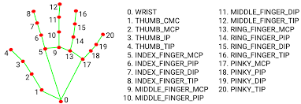
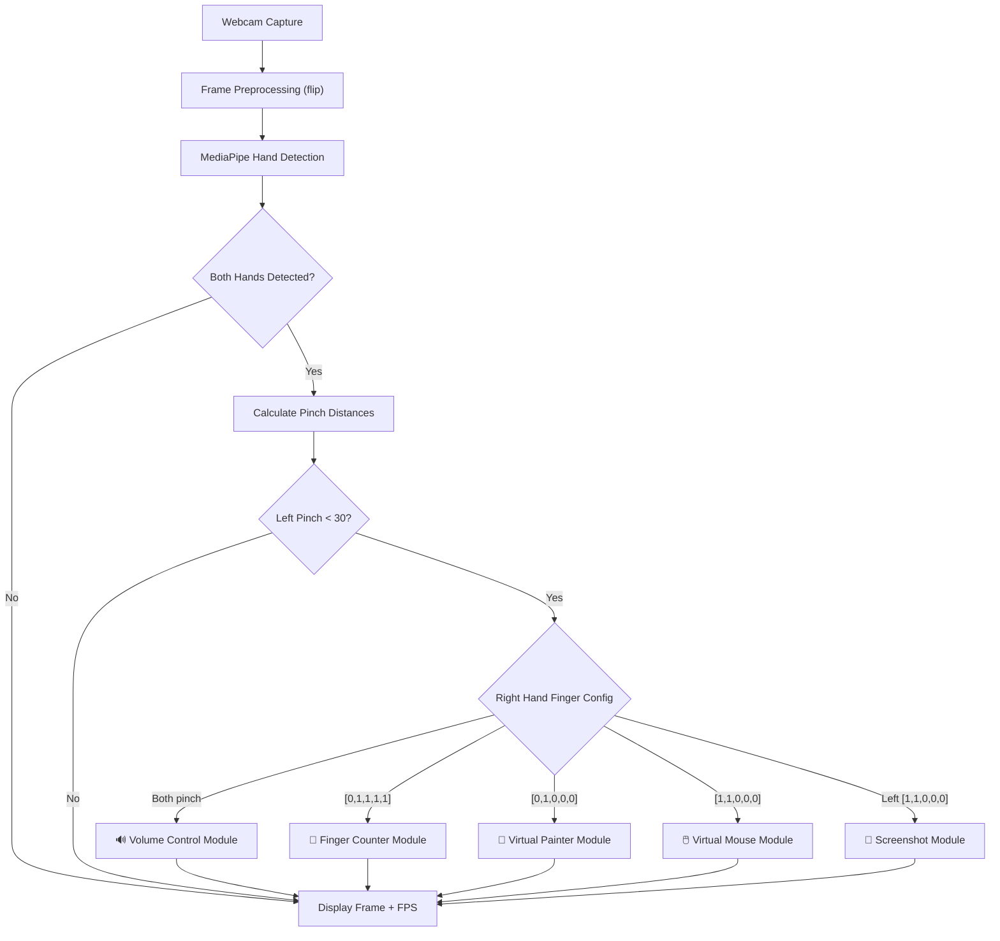

<div align="center">

# 🖐️ AI Virtual Controller

### Control your computer using nothing but your hands.

[](https://www.python.org/)
[](https://opencv.org/)
[](https://mediapipe.dev/)
[](LICENSE)
[]()

<br/>



<br/>

*A real-time, gesture-driven desktop controller powered by computer vision and hand tracking.  
Adjust volume, move the mouse, draw on screen, count fingers, and take screenshots — all hands-free.*

---

</div>

## 📋 Table of Contents

- [Overview](#-overview)
- [Features](#-features)
- [Demo](#-demo--screenshots)
- [Project Structure](#-project-structure)
- [Architecture / Workflow](#-architecture--workflow)
- [Technologies Used](#-technologies-used)
- [Requirements](#-requirements)
- [Installation](#-installation)
- [Usage](#-usage)
- [Controls & Gestures](#-controls--gestures)
- [Configuration](#-configuration)
- [Examples](#-examples)
- [Known Issues / Limitations](#-known-issues--limitations)
- [Future Improvements](#-future-improvements)
- [License](#-license)
- [Author](#-author)

---

## 🌟 Overview

**AI Virtual Controller** is a real-time computer vision application that transforms your webcam into a full-featured, gesture-based input device. Using **MediaPipe** hand tracking and **OpenCV**, the system detects and tracks both hands simultaneously, interpreting specific finger gestures to perform desktop actions — replacing the need for a physical mouse, keyboard shortcuts, or touchpad.

### The Problem It Solves

Traditional input devices require physical contact and direct access to hardware. This project enables **touchless interaction** with your computer, useful for:

- 🎤 **Presentations** — control slides and volume without a clicker.
- ♿ **Accessibility** — hands-free computing for users with limited mobility.
- 🧪 **Experimentation** — explore gesture-based UX paradigms.
- 🎨 **Creative workflows** — draw directly on your screen with hand gestures.

### How It Works

The system uses a **dual-hand activation model**:

1. The **left hand** acts as a *mode selector* — a pinch gesture (thumb + index finger close together) locks into a module.
2. The **right hand** performs the *action* within the selected module — its finger configuration at the moment of the left-hand pinch determines which module activates.

This design prevents accidental activations and provides intuitive, reliable control.

---

## ✨ Features

| Module | Description |
|---|---|
| 🔊 **Volume Control** | Adjust system volume in real-time by pinching both hands, then spreading/closing the right hand's thumb and index finger. Visual volume bar and percentage overlay. |
| 🖱️ **Virtual Mouse** | Move the cursor across the screen with your index finger. Click by bringing the index and middle fingers together. Supports smoothed movement for precision. |
| 🎨 **Virtual Painter** | Draw on-screen in multiple colors (Red, Blue, Green) using your index finger. Switch colors and erase with a selection toolbar. Persistent canvas layer. |
| 🔢 **Finger Counter** | Counts the number of raised fingers on the right hand and displays a corresponding visual overlay image (0–5). |
| 📸 **Screenshot Capture** | Take timestamped screenshots saved to a local folder. Includes visual confirmation overlay, cooldown protection, and error handling. |

### Additional Capabilities

- **Dual-hand tracking** — independently tracks left and right hands with separate landmark lists.
- **Real-time FPS display** — on-screen performance monitor.
- **Graceful hand loss handling** — modules tolerate brief hand disappearances via a missing-frame counter.
- **Visual feedback** — circles, lines, and overlays indicate active gestures and system state.

---

## 📸 Demo / Screenshots

> Add screenshots or GIF recordings of each module in action to the `Screenshots/` folder and update the paths below.

<!-- Uncomment and update paths once you have screenshots:

### Volume Control


### Virtual Mouse


### Virtual Painter


### Finger Counter


### Screenshot Module


-->

---

## 📁 Project Structure

```
AI_Virtual_Controller/
│
├── AIVirtualController/
│   └── AIVirtualController.py      # Main application — orchestrates all modules
│
├── Lib/
│   └── library.py                  # HandDetector class (MediaPipe wrapper)
│
├── Images/
│   ├── HandsPoint.png              # Hand landmark reference diagram
│   ├── FingerNumberImage/          # Overlay images for finger count (0.png – 5.png)
│   └── HeaderVirtualPainter/       # Color selection toolbar headers
│       ├── 1_Start.png
│       ├── 2_Red.png
│       ├── 3_Blue.png
│       ├── 4_Green.png
│       └── 5_Eraser.png
│
├── Screenshots/                    # Auto-generated screenshot output folder
├── .gitignore
└── README.md
```

### Module Breakdown

| File | Role |
|---|---|
| `AIVirtualController.py` | Entry point. Captures webcam frames, runs hand detection, dispatches to the correct module based on gesture state, and manages the main event loop. |
| `library.py` | Reusable `HandDetector` class wrapping MediaPipe Hands. Provides methods: `findHands()`, `findPosition()`, `fingersUp()`, `findDistance()`, `getDetectedHands()`. Supports dual-hand tracking with backward compatibility. |
| `FingerNumberImage/` | Contains 6 PNG images (0–5) displayed as overlays when the Finger Counter module is active. |
| `HeaderVirtualPainter/` | Contains 5 header toolbar images for the Virtual Painter, each representing a color or the eraser tool. |

---

## 🏗️ Architecture / Workflow



### Data Flow

1. **Capture** — Each frame is read from the webcam and horizontally flipped (mirror view).
2. **Detection** — `HandDetector.findHands()` runs MediaPipe inference and draws landmarks.
3. **Positioning** — `findPosition()` extracts 21 landmark coordinates per hand, stored in `lmLists["Left"]` and `lmLists["Right"]`.
4. **Gesture Analysis** — Pinch distances and `fingersUp()` results determine the active module.
5. **Module Execution** — The selected module enters its own `while` loop, continuously processing frames until the activation gesture is released.
6. **Display** — Processed frames with overlays, UI elements, and FPS are rendered via OpenCV's `imshow()`.

---

## 🛠️ Technologies Used

| Technology | Purpose | Version |
|---|---|---|
| **Python** | Core language | 3.8+ |
| **OpenCV** (`cv2`) | Video capture, image processing, UI rendering | 4.x |
| **MediaPipe** | Real-time hand landmark detection | Latest |
| **NumPy** | Numerical computations (distance, interpolation) | Latest |
| **autopy** | System-level mouse movement and clicking | Latest |
| **pycaw** | Windows audio endpoint control (volume) | Latest |
| **comtypes** | COM interface for Windows audio API | Latest |
| **pyautogui** | Screenshot capture | Latest |

---

## 📦 Requirements

### Software

- **Python** 3.8 or higher
- **pip** (Python package manager)
- **Windows OS** (required for `pycaw` audio control and `autopy` mouse control)

### Hardware

- 🎥 **Webcam** — any USB or built-in camera (minimum 480p recommended)
- 💻 **CPU** — modern multi-core processor for real-time inference
- 🖥️ **Display** — standard monitor (resolution auto-detected by `autopy`)

### Python Dependencies

```
opencv-python
mediapipe
numpy
autopy
pycaw
comtypes
pyautogui
```

---

## ⚙️ Installation

### 1. Clone the Repository

```bash
git clone https://github.com/YousefOsama20/AI_Virtual_Controller.git
cd AI_Virtual_Controller
```

### 2. Create a Virtual Environment (Recommended)

```bash
python -m venv venv
```

**Activate the environment:**

```bash
# Windows (PowerShell)
.\venv\Scripts\Activate.ps1

# Windows (CMD)
.\venv\Scripts\activate.bat
```

### 3. Install Dependencies

```bash
pip install opencv-python mediapipe numpy autopy pycaw comtypes pyautogui
```

> **Note:** `autopy` may require Visual Studio Build Tools on some Windows systems.  
> If installation fails, install [Microsoft C++ Build Tools](https://visualstudio.microsoft.com/visual-cpp-build-tools/) and retry.

### 4. Verify Camera Access

Ensure your webcam is connected and accessible. No additional drivers should be needed for most USB cameras.

---

## 🚀 Usage

### Running the Application

```bash
python AIVirtualController/AIVirtualController.py
```

### What Happens on Launch

1. The webcam feed opens in a window titled **"Image"**.
2. Both hand landmarks are drawn on-screen in real-time.
3. FPS is displayed in the top-left corner.
4. Use gesture combinations (see below) to activate modules.

### Quitting

Press **`q`** at any time to exit the application.

---

## 🤲 Controls & Gestures

The system uses a **two-hand activation model**. The left hand's pinch gesture acts as an "enable" switch, and the right hand's finger configuration selects the module.

### Activation: Left Hand Pinch

> Bring your **left thumb** and **left index finger** close together (distance < 30 pixels). Hold this pinch to remain in the selected module. Release to exit back to the idle state.

### Module Selection: Right Hand Finger Patterns

| Module | Right Hand Gesture | Fingers Pattern | Description |
|---|---|---|---|
| 🔊 **Volume Control** | Both hands pinching | Both `< 30` | Both thumb + index on each hand are pinched simultaneously. Right hand spread controls volume level. |
| 🔢 **Finger Counter** | Four fingers + thumb down | `[0, 1, 1, 1, 1]` | Index, middle, ring, and pinky raised; thumb closed. |
| 🎨 **Virtual Painter** | Index finger only | `[0, 1, 0, 0, 0]` | Only index finger raised; all others closed. |
| 🖱️ **Virtual Mouse** | Thumb + index finger | `[1, 1, 0, 0, 0]` | Thumb and index raised; all others closed. |
| 📸 **Screenshot** | Left hand: thumb + index | `Left: [1, 1, 0, 0, 0]` | Left hand shows thumb + index; right hand pinches to enter, then left index-only triggers capture. |

### In-Module Controls

#### 🔊 Volume Control
| Gesture | Action |
|---|---|
| Spread right thumb + index | Increase volume |
| Close right thumb + index | Decrease volume |
| Full pinch (< 20px) | Mute indicator (green dot) |

#### 🖱️ Virtual Mouse
| Gesture | Action |
|---|---|
| Index finger only (right hand) | Move cursor |
| Index + middle finger raised | Enter click mode |
| Index + middle close together (< 30px) | Perform click |

#### 🎨 Virtual Painter
| Gesture | Action |
|---|---|
| Index + middle finger raised | Selection mode — hover over toolbar to pick color |
| Index finger only | Drawing mode — draw on canvas |
| Select **Red** zone on toolbar | Switch to red brush |
| Select **Blue** zone on toolbar | Switch to blue brush |
| Select **Green** zone on toolbar | Switch to green brush |
| Select **Eraser** zone on toolbar | Switch to eraser (large black brush) |

#### 🔢 Finger Counter
| Gesture | Action |
|---|---|
| Raise 0–5 fingers (right hand) | Corresponding number image displayed as overlay |

#### 📸 Screenshot
| Gesture | Action |
|---|---|
| Left hand: only index finger raised | Captures screenshot |
| Automatic | 2-second cooldown between captures |
| On-screen banner | Shows "Screenshot Saved!" or error message for 1.5 seconds |

---

## ⚙️ Configuration

Key parameters can be adjusted directly in `AIVirtualController.py`:

### Camera Settings

| Parameter | Default | Description |
|---|---|---|
| `Wcam` | `640` | Webcam frame width (pixels) |
| `Hcam` | `480` | Webcam frame height (pixels) |

### Hand Detection (in `library.py`)

| Parameter | Default | Description |
|---|---|---|
| `maxHands` | `2` | Maximum number of hands to track |
| `detectionCon` | `0.7` | Minimum detection confidence threshold |
| `trackCon` | `0.7` | Minimum tracking confidence threshold |

### Virtual Mouse

| Parameter | Default | Description |
|---|---|---|
| `FramR` | `100` | Frame reduction — margin (pixels) for the active mouse region |
| `Smoothening` | `3` | Mouse movement smoothing factor (higher = smoother but slower) |

### Virtual Painter

| Parameter | Default | Description |
|---|---|---|
| `BrachThicknessPainter` | `15` | Brush stroke thickness (pixels) |
| `EraserThicknessPainter` | `70` | Eraser stroke thickness (pixels) |

### Screenshot Module

| Parameter | Default | Description |
|---|---|---|
| `screenshot_cooldown` | `2` | Minimum seconds between screenshots |
| `screenshot_message_duration` | `1.5` | How long the confirmation message displays (seconds) |
| `screenshot_folder` | `Screenshots/` | Output directory for saved screenshots |

### Gesture Activation Thresholds

| Parameter | Default | Description |
|---|---|---|
| Pinch threshold | `30` | Distance (pixels) between thumb and index finger to activate a module |
| Click threshold | `30` | Distance for mouse click in Virtual Mouse module |
| Volume range | `20–150` | Finger distance mapped to `minVol–maxVol` |

---

## 💡 Examples

### Example 1: Adjust Volume

1. Place both hands in front of the camera.
2. Pinch both thumb + index fingers simultaneously (both distances < 30).
3. The Volume Control module activates — a volume bar appears on the left side.
4. Spread or close your **right hand** thumb and index to raise or lower volume.
5. Release the **left hand** pinch to exit.

### Example 2: Draw on Screen

1. Show both hands. Pinch your left hand, and raise only the **index finger** on your right hand `[0, 1, 0, 0, 0]`.
2. The Virtual Painter toolbar appears at the top of the screen.
3. Raise **index + middle** fingers on the right hand to enter **selection mode** — hover over a color zone.
4. Lower the middle finger to enter **drawing mode** — move your index finger to draw.
5. Select the Eraser to clear parts of your drawing.
6. Release the left pinch to exit.

### Example 3: Move and Click the Mouse

1. Show both hands. Pinch your left hand, and raise **thumb + index** on your right hand `[1, 1, 0, 0, 0]`.
2. The Virtual Mouse module activates — a blue bounding box shows the active tracking region.
3. Move your **right index finger** to move the cursor.
4. Raise your **middle finger** alongside the index finger, then bring them close together to click.
5. Release the left pinch to exit.

---

## ⚠️ Known Issues / Limitations

| Issue | Details |
|---|---|
| **Windows Only** | `pycaw` (volume control) and `autopy` (mouse control) are Windows-specific. Cross-platform support is not available out of the box. |
| **Hardcoded Image Paths** | `FingerNumberImage` and `HeaderVirtualPainter` folder paths use an absolute path (`F:\Github\AI_Virtual_Controller\...`). This must be updated if the project is cloned to a different location. |
| **Lighting Sensitivity** | MediaPipe hand detection performance degrades in poor lighting conditions or with complex backgrounds. |
| **Single-User Design** | The system is designed for one user at a time. Multiple people in frame may cause unexpected behavior. |
| **Canvas Not Saved** | The Virtual Painter canvas is in-memory only and is lost when the application exits. |
| **No Multi-Monitor Support** | `autopy` maps to the primary display only. |
| **Pinch Sensitivity** | The 30-pixel threshold may need tuning depending on camera resolution and distance from the camera. |
| **Finger Counter Overlay Count** | Only 6 images (0–5) are provided; behavior depends on having exactly these files in the folder. |

---

## 🚀 Future Improvements

- 🌐 **Cross-platform support** — replace `pycaw` and `autopy` with platform-agnostic alternatives (e.g., `pynput`, `pyaudio`).
- 💾 **Save / export canvas** — allow the Virtual Painter to save drawings as image files.
- 📂 **Relative path resolution** — replace hardcoded absolute paths with dynamic, relative paths.
- 🧩 **Plugin architecture** — modularize each feature into separate classes for easier extension.
- 🎙️ **Voice + gesture hybrid** — combine voice commands with hand gestures for richer control.
- ⌨️ **Virtual keyboard module** — add a gesture-based on-screen keyboard.
- 🖥️ **GUI settings panel** — add a configuration UI instead of editing code constants.
- 📊 **Gesture customization** — allow users to define their own gesture-to-action mappings.
- 🎯 **Gesture training / calibration** — personalized calibration for different hand sizes and camera setups.
- 🔄 **Multi-monitor support** — extend Virtual Mouse to work across multiple displays.
- 📹 **Screen recording** — add a gesture-activated screen recording module.

---

## 📄 License

This project is licensed under the **MIT License** — see the [LICENSE](LICENSE) file for details.

> **Note:** A `LICENSE` file has not been created yet. It is recommended to add one. You can generate an MIT license at [choosealicense.com](https://choosealicense.com/licenses/mit/).

---

## 👤 Author

**Yousef Osama**

- GitHub: [@YousefOsama20](https://github.com/YousefOsama20)

---

<div align="center">

Made with ❤️ and ✋ hand gestures

</div>
